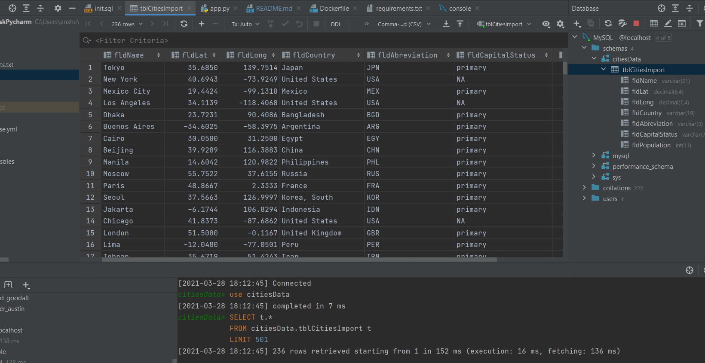
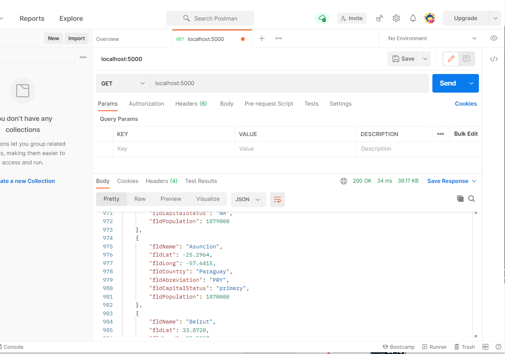
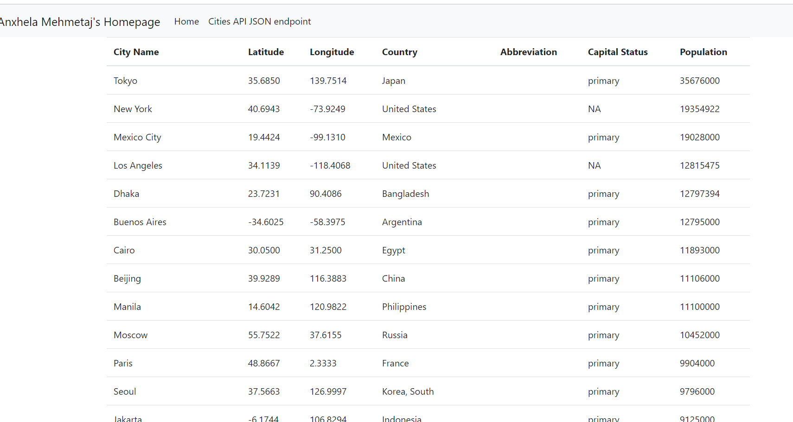
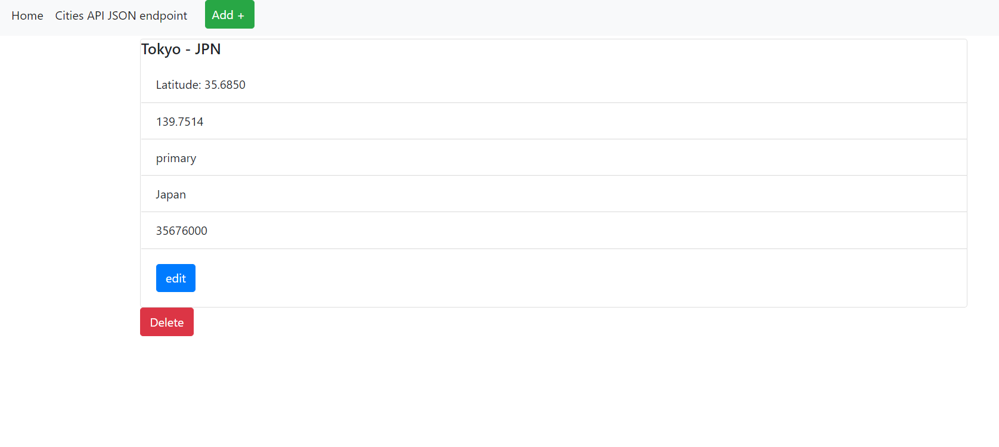
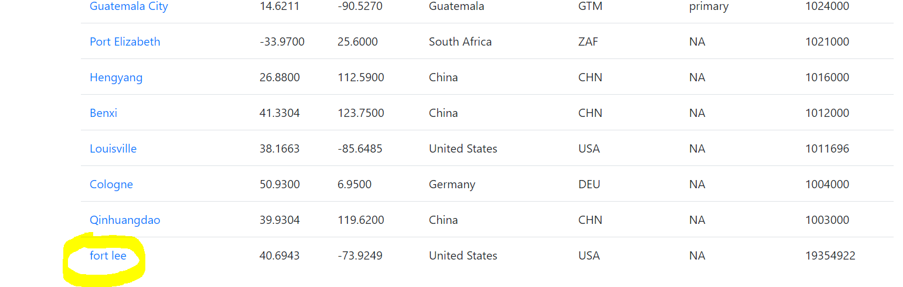
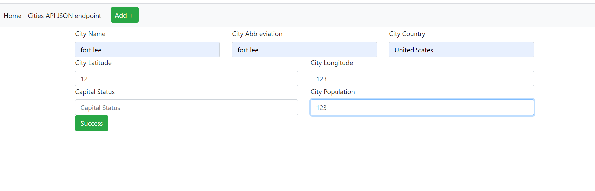

# Anxhela Mehmetaj 
 
 ##Project Description 

This homework assignment is related how to get Pycharm setup with Docker, Flask, MySQL
 

 This is SQL DATA QUERY

 Homework 2
 

 Homework 3
 
HTML Card View 
 
 
 
 
